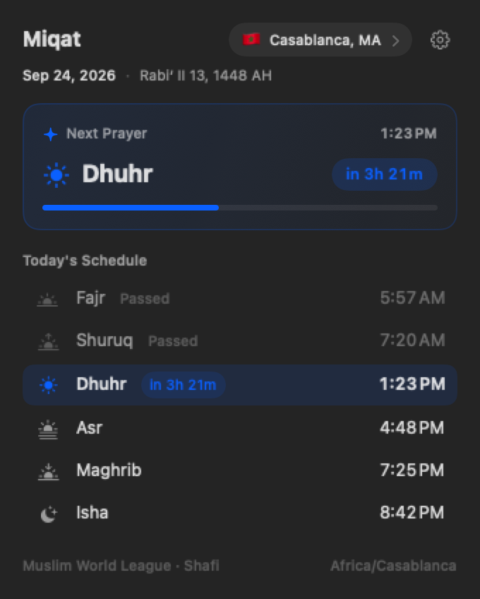
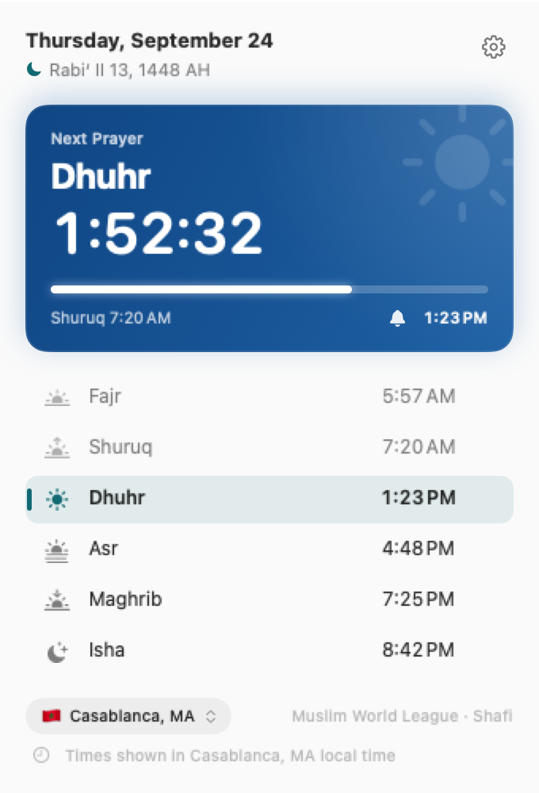
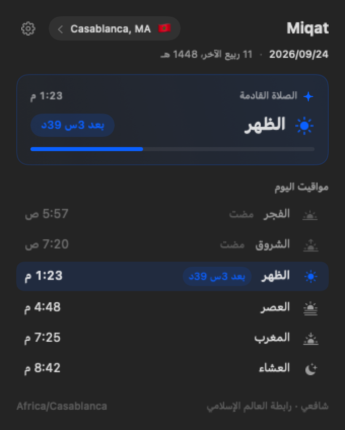
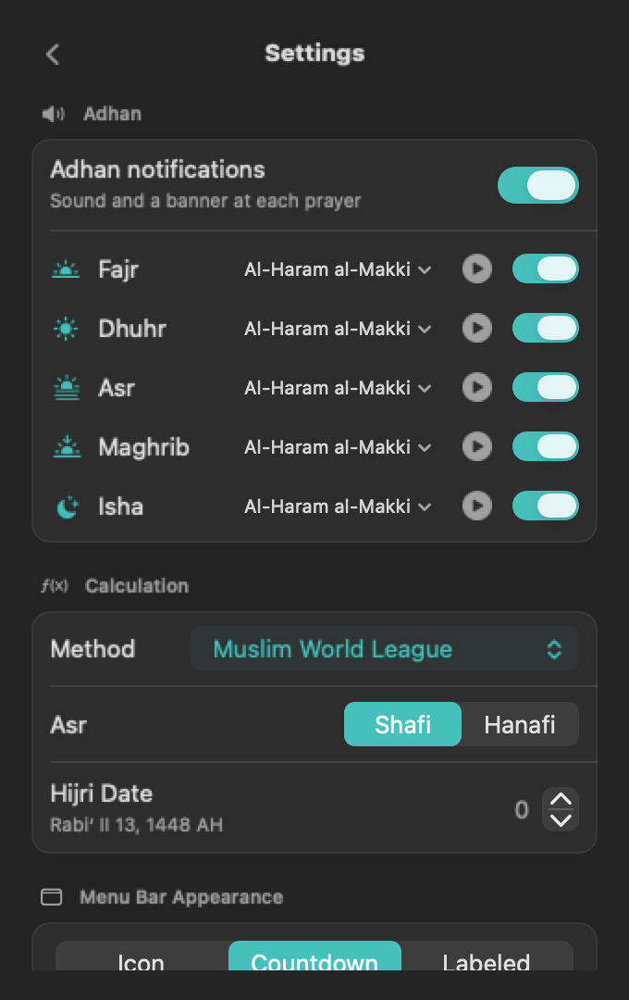
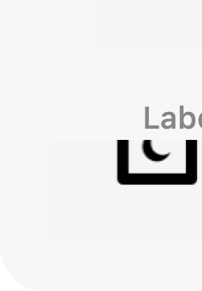

# Miqat

A tiny macOS menu bar app that shows how long remains until the next prayer:

```
Asr 1:23
```


<p align="center">
  
</p>

## Features

- **Live countdown to the next prayer** in the menu bar, always visible —
  three themes:
  - *Icon* — just the mihrab glyph, Control Center style (countdown in the tooltip)
  - *Countdown* — `1:23`
  - *Labeled* — `Asr 1:23`
- **Next prayer hero card** — prominent header card displaying the upcoming
  prayer, target clock time, live ticking countdown capsule, and a smooth
  interval progress bar
- **Celestial SF Symbols** — atmospheric icons tailored for each prayer
  (Fajr, Shuruq, Dhuhr, Asr, Maghrib, Isha) with visual indicators for
  passed, active, and upcoming prayers
- **Dedicated Settings panel** — keeps the daily timetable uncluttered with
  an on-demand settings view for calculations, appearance, language, and system
- **Arabic & English interface** — in-app language switcher (System /
  English / العربية), localized prayer, method, and madhab names, Arabic
  Hijri/Gregorian dates, and full right-to-left layout
- **Today's full schedule** — Fajr, Shuruq, Dhuhr, Asr, Maghrib, Isha — with
  the next prayer highlighted and Gregorian + Hijri dates
- **Fully offline** — a bundled database of ~12,400 cities (GeoNames,
  population ≥ 50k) powers instant city search, with no internet at any point:
  - pick a city from the bundled list
  - enter coordinates manually — the nearest notable bundled city supplies
    the time zone and a "Near …" label
  - auto-detect (the only online path) names the fix via the nearest city
    even when Apple's geocoder is unreachable
- **12 calculation methods** — Muslim World League, Umm al-Qura (Makkah),
  ISNA, Egyptian, Karachi, Dubai, Qatar, Kuwait, Moonsighting Committee,
  Singapore/Malaysia, Turkey (Diyanet), Tehran
- **Asr madhab** — Shafi (Standard) or Hanafi
- **Times computed locally** with
  [adhan-swift](https://github.com/batoulapps/adhan-swift) (MIT) — works fully
  offline once your city is set; the day rolls over at the *location's*
  midnight, in the location's time zone

## Screenshots

### Native Menu Bar

Compact, monospaced countdown that never causes neighboring icons to jitter:

<picture>
  <source media="(prefers-color-scheme: dark)" srcset="Docs/menubar-dark.png">
  <source media="(prefers-color-scheme: light)" srcset="Docs/menubar-light.png">
  
</picture>

### Detailed Popover

Click the menu bar item anytime for the hero countdown, today's schedule, and dual Gregorian/Hijri dates:

<p align="center">
  
  &nbsp;&nbsp;
  
  &nbsp;&nbsp;
  
</p>

### Dedicated Settings

Access calculation methods, madhab, appearance, and language options without cluttering the main schedule:

<p align="center">
  
</p>

### Three Menu Bar Themes

Icon (Control Center style), Countdown, or Labeled:

<p align="center">
  
</p>

## Install

### Homebrew

```bash
brew install --cask HamzaSamirAmmar/tap/miqat
xattr -d com.apple.quarantine /Applications/Miqat.app
```

Miqat is ad-hoc signed (not notarized), so macOS blocks the downloaded copy
on first launch — the `xattr` line clears that once and works on every
Homebrew version. (Right-click → **Open** → **Open** in Finder works too.)

### From a release

Download `Miqat.zip` from the [Releases](../../releases) page, unzip, and drag
`Miqat.app` to `/Applications`. Right-click the app → **Open** → **Open** to
get past the first-launch warning.

### From source

```bash
xcodegen generate          # requires: brew install xcodegen
xcodebuild -project Miqat.xcodeproj -scheme Miqat -configuration Release \
  -derivedDataPath build build
cp -R build/Build/Products/Release/Miqat.app /Applications/
```

## Privacy

Location is used once to resolve your city and never leaves the Mac. Only
"Use My Location" can ever touch the network (Macs locate via Wi-Fi
positioning, an online Apple lookup — offline, the fix itself fails and the
error says so). City search, manual coordinates, and all time calculations
are pure local math and work fully offline.

## Credits

- Prayer time calculation:
  [adhan-swift](https://github.com/batoulapps/adhan-swift) by Batoul Apps
  (MIT), based on *Astronomical Algorithms* by Jean Meeus
- Reference test data: Umm al-Qura University official timetable
  (ummulqura.org.sa), as compiled in the adhan test suite
- City database: [GeoNames](https://www.geonames.org), licensed
  [CC BY 4.0](https://creativecommons.org/licenses/by/4.0/) — regenerate the
  bundled subset with `python3 scripts/build_cities.py`

## Building

Requires Xcode 15+ and [XcodeGen](https://github.com/yonaskolb/XcodeGen):

```sh
xcodegen generate
xcodebuild -project Miqat.xcodeproj -scheme Miqat build
```

Or via the Swift Package Manager (compiles the sources and runs the tests):

```sh
swift build
swift test
```

## License

[MIT](LICENSE)
